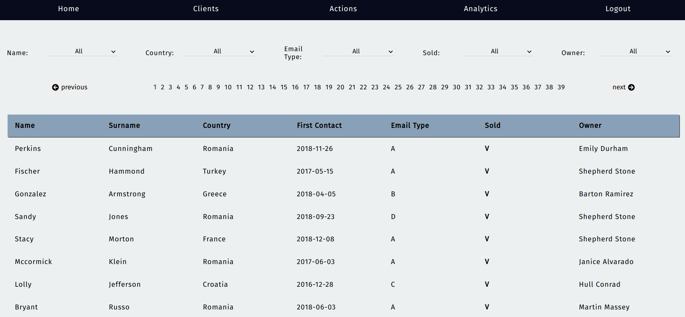
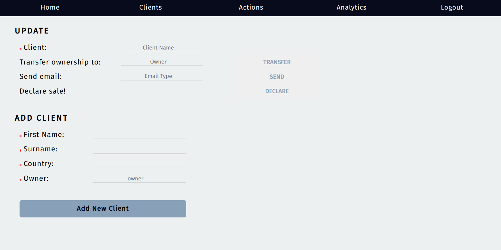
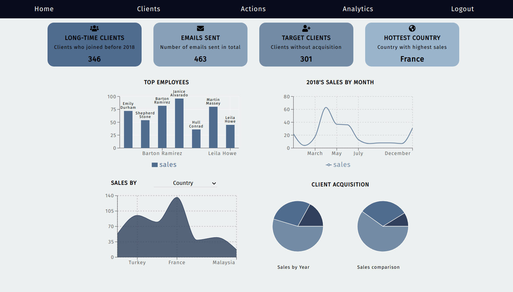

#   [CRM-react](https://crm-system-app.herokuapp.com/)

A full stack customer relationship management platform built with ReactJS and NodeJS.

## :curly_haired_woman: Clients 
Manage your clients data, including multiple filtering.
# 

## :arrow_forward: Actions
Perform actions regarding your clients, such as adding a new client, changing client's owner.
# 

## :chart_with_upwards_trend: Analytics
View clients and sales stats
# 

For client-side only, please visit: https://sigalsha.github.io/CRM-react/
